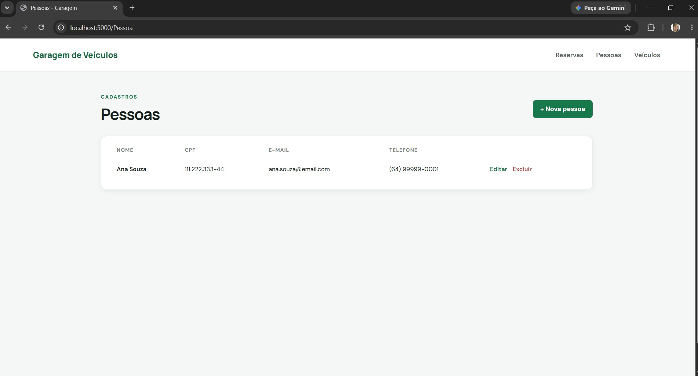
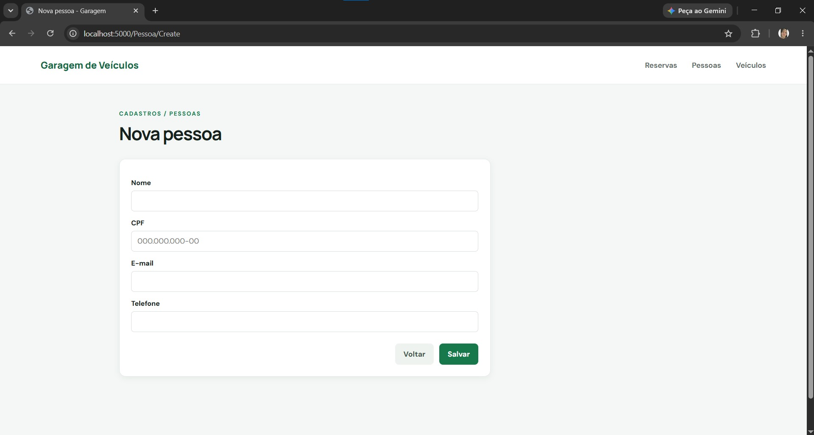
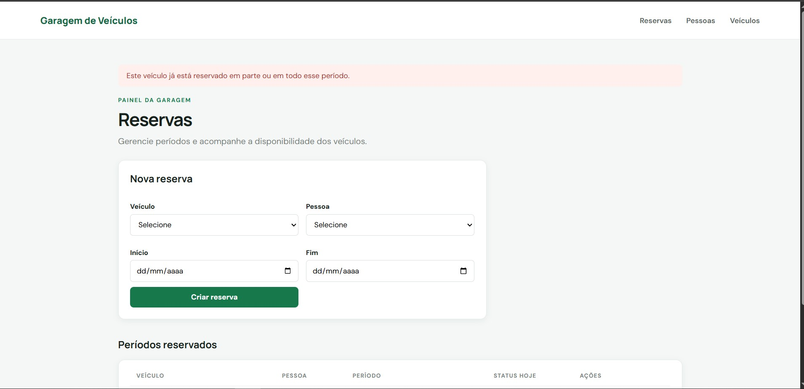

# Garagem de Veículos

Projeto da atividade prática de Arquitetura de Software (ESW430), implementado em C# com ASP.NET Core MVC (.NET 8).

## Integrante

- Thiago de Oliveira Rodrigues

## Arquitetura

O sistema separa Models, Controllers, contratos de repositório e implementações JSON. Os controllers recebem interfaces pelo construtor; o container registra as implementações em `Program.cs`. O acesso aos arquivos fica nos repositórios por meio do helper de persistência JSON. A validação de conflito entre reservas está em `ReservaService`, fora do controller.

## Funcionalidades

- CRUD de pessoas com campos obrigatórios, validação de e-mail e CPF único.
- CRUD de veículos com placa única.
- Página inicial de reservas: associação de pessoa e veículo, edição de período e cancelamento.
- Bloqueio de períodos conflitantes (datas de início/fim inclusivas) e validação de datas e entidades existentes.
- Status Disponível/Reservado na data atual.
- Persistência em `Data/pessoas.json`, `Data/veiculos.json` e `Data/reservas.json`.
- Exclusão de pessoas e veículos bloqueada quando há reserva associada.

## Executar

Requer SDK .NET 8. No terminal, a partir desta pasta:

```powershell
dotnet restore
dotnet run
```

Abra o endereço local exibido no terminal. Reservas é a página inicial. Os arquivos JSON são criados automaticamente se estiverem ausentes.

## Ferramentas de IA

ChatGPT (OpenAI) foi usado para apoiar a elaboração do código e da documentação. O integrante deve revisar e estar preparado para explicar a arquitetura e as regras implementadas.

## Entrega no Classroom

Crie/publicize um repositório no GitHub, envie o mesmo link no Classroom e inclua capturas de tela da listagem/formulário de Pessoas, da página de Reservas e de uma tentativa de conflito bloqueada. O link e as capturas precisam ser adicionados pelo integrante antes do envio.

## Capturas de tela

### Listagem de pessoas



### Formulário de pessoa



### Conflito de reserva bloqueado


